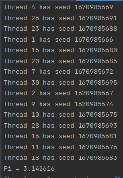

# 2. Программы с багами
`omp_bugreduction_fixed.c` – код для скалярного произведения двух векторов.   

`omp_bugparfor_fixed.c` – устранены ошибки.  

# 3. Написать параллельную программу, использующую метод Монте-Карло для оценки числа pi.
Случайным образом кидаете точку в единичный квадрат. В этот же квадрат вписан круг. Если точка попала в круг, увеличиваете счетчик. Затем находите отношение точек, попавших в круг к общему числу точек. Зная площади квадрата и круга, находите приблизительно число pi.  
`pi.c` – код поиска чичла pi.  
